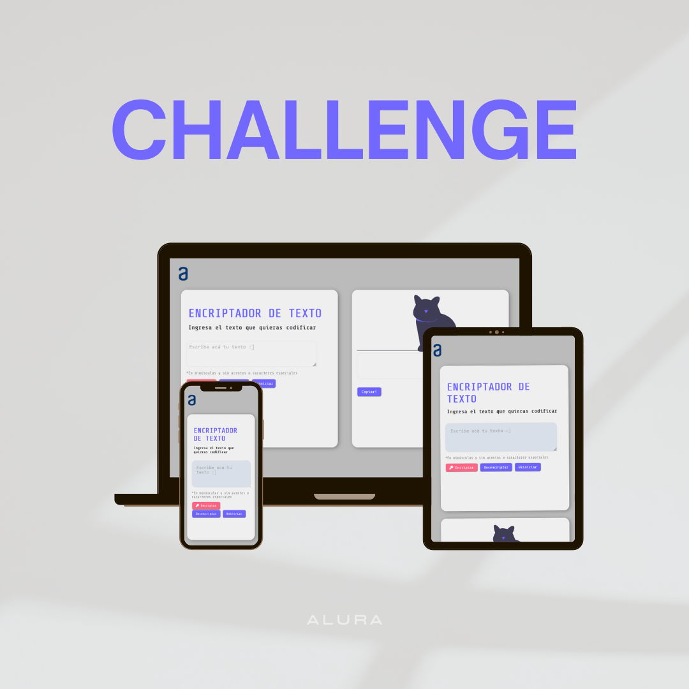

# Encriptador de Texto

## Introducción 🚀
Este proyecto, desarrollado como parte del programa de ONE Oracle y Alura 2024, es un desafío para poner en práctica los conocimientos adquiridos en el curso. Se trata de un encriptador de texto que permite a los usuarios intercambiar mensajes secretos utilizando reglas específicas de encriptación.

## Objetivos 🎯
El objetivo principal de este proyecto es implementar un encriptador de texto funcional que convierta las letras según un conjunto de reglas predefinidas. Entre los objetivos específicos se encuentran:
- Desarrollar la lógica de encriptado y desencriptado según las llaves proporcionadas, las cuales son:
  - La letra "e" es convertida para "enter"
  - La letra "i" es convertida para "imes"
  - La letra "a" es convertida para "ai"
  - La letra "o" es convertida para "ober"
  - La letra "u" es convertida para "ufat"
- Garantizar que la aplicación funcione únicamente con letras minúsculas y sin acentos ni caracteres especiales.
- Permitir al usuario ingresar un texto y encriptarlo, así como desencriptar un texto encriptado para obtener la versión original.

## Desarrollo 💻
El proyecto se desarrolló utilizando HTML, CSS y JavaScript. La interfaz de usuario fue diseñada de forma sencilla e intuitiva, permitiendo al usuario ingresar el texto a encriptar o desencriptar. Se implementaron funciones en JavaScript para realizar la lógica de encriptado y desencriptado según las llaves establecidas.

Al desarrollar este encriptador de texto, utilicé el método replace junto con expresiones regulares (regex) para manejar los caracteres especiales en el texto ingresado por el usuario. Cuando un usuario ingresa un texto con mayúsculas, acentos o caracteres especiales, aplicamos un regex para identificarlos y limpiar el text area. Luego, utilizando el método replace, reemplazamos (a, i, u, e, o) con su equivalente encriptado. Este enfoque permitió transformar el texto de acuerdo con las reglas de encriptación especificadas, asegurando así que el resultado final esté en el formato deseado.

## Mejoras futuras 🌟
(Queda pendiente**)
Mejorar el CSS y la experiencia de usuario, verificar uso del botón de copiar, la alerta de mayúsculas y minúsulas se borra muy rápido.

## Créditos de las imágenes 📸
Las imágenes de los gatitos utilizadas en este proyecto fueron proporcionadas por [undraw.co](https://undraw.co). ¡Gracias por los gatitxs!
